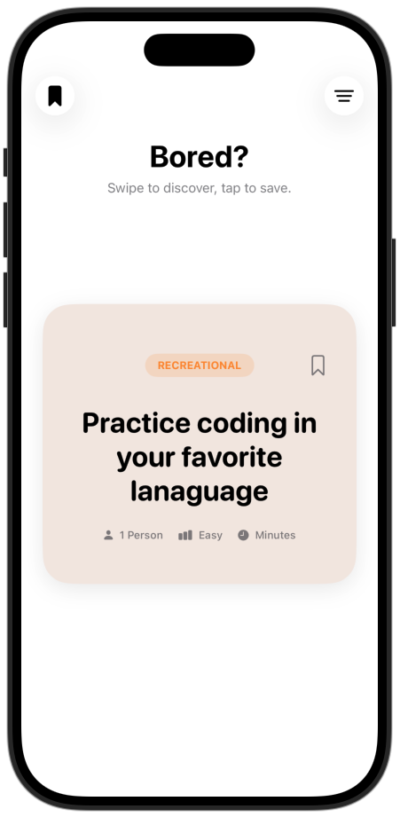
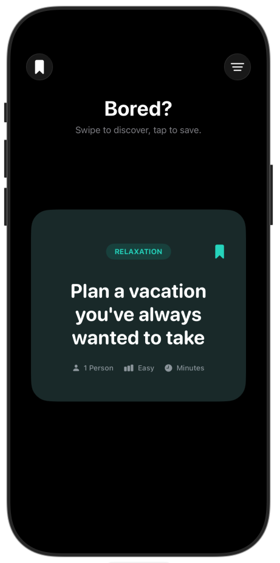
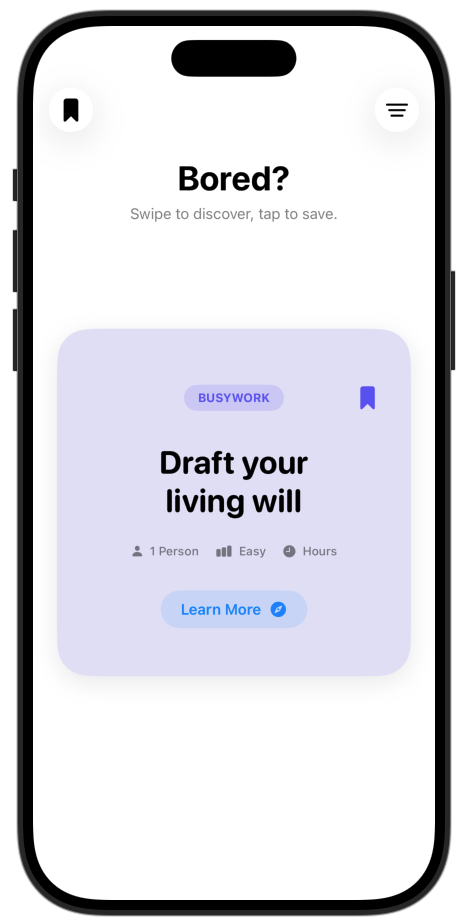
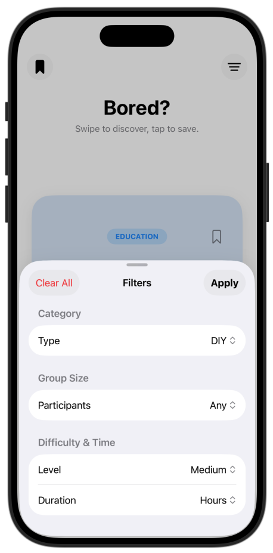
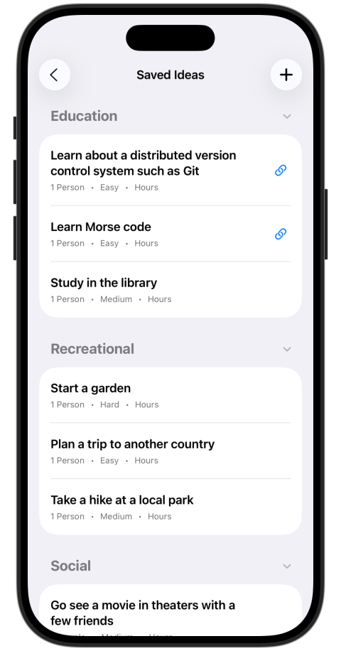
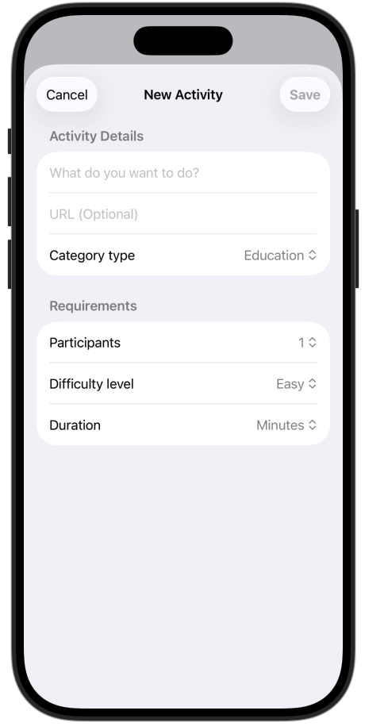
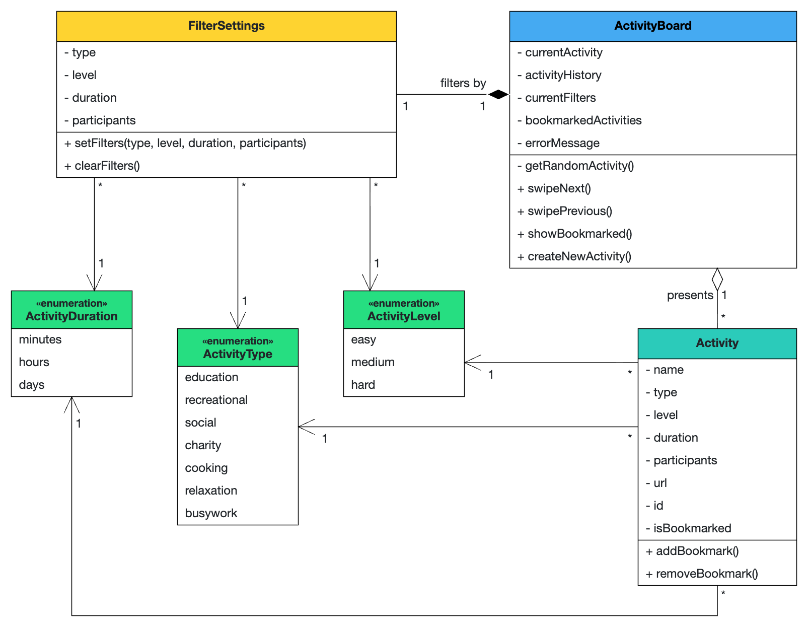
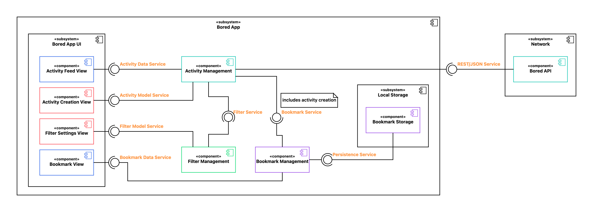

# iPraktikum 2026: Bored App

Welcome on **Bored**! For [TUM's iPraktikum](https://aet.cit.tum.de/projects/courses/ipraktikum/) course in the summer semester 2026, I built this small iOS app to get familiar with Swift and the basics of iOS development. The app makes free-time activity suggestions to bored users using App Brewery's [Bored API](https://bored-api.appbrewery.com/). It displays them in a swipeable activity feed and allows you to filter, create and bookmark suggestions. Feel free to try it out on Xcode!

See the Bored App pitch [here](https://docs.google.com/presentation/d/1nwyZ1IFpkkA1n9EGVJE3uOFfknhHr1x5Uq2lz56wDT4/edit?usp=sharing).





## Local Development

To test or further develop the Bored App, you can use XcodeGen and manage this project on Xcode.

**What is XcodeGen?** XcodeGen is a tool that automatically generates Xcode project files from a simple configuration file. Instead of manually managing complex Xcode project settings, you define your project structure in the provided `project.yml` file, and XcodeGen creates the `.xcodeproj` file for you. This makes it easier to manage your Xcode project under version control (git), and resolve any merge conflicts that arise.

**Why do you need this?** When you clone this repository, you won't find a ready-to-use `.xcodeproj` file, which you can directly open with Xcode. Instead, you'll find a `project.yml` configuration file that describes how the Xcode project should be set up. You need to generate the actual Xcode project file before you can open and work on the app in Xcode.

1. Install tools (if you don't have [Homebrew](https://brew.sh), install it first)
    ```bash
    brew install xcodegen swiftlint
    ```
2. Generate .xcodeproj
    ```bash
    xcodegen generate
    ```

    After running this command, you'll see a new `.xcodeproj` file appear in your project folder. You can then double-click this file to open your project in Xcode.

Since the `xcodegen generate` command must be run when the project is cloned and whenever changes affect the project structure, you can enable Git hooks to run the command automatically after merges and pulls.

Run the following command to point `git` to the hooks:
```bash
git config core.hooksPath .githooks
```

## Project Documentation

This section contains the project's full problem statement, architecture and requirements documentation.

### Problem Statement

#### The Problem
In an era of infinite digital connectivity, a paradoxical phenomenon has emerged: the more options we have for entertainment, the less likely we are to choose any of them. This is known as "The Paradox of Choice." When an individual finds themselves with a sudden window of free time — whether it’s a quiet Saturday afternoon or an hour between commitments — they are often met with a paralyzing "Decision Fatigue."

Instead of engaging in fulfilling activities, many people default to "passive consumption," such as mindlessly scrolling through social media feeds or cycling through streaming service menus without ever hitting play. The problem isn't a lack of things to do: it is the cognitive load required to filter through dozens of possibilities, weigh their costs, and evaluate their social requirements in real-time.

#### Who is Affected
This problem primarily affects "Generation Digital" — students, freelancers and young professionals who are constantly bombarded by algorithmic suggestions but lack a simple, randomized tool for real-world spontaneous action. It also affects individuals who feel "stuck" in their routines and social groups who find themselves in a repetitive loop of going to the same locations.

#### Why Solving it Matters
Solving this problem is about more than just "curing boredom" - it is about mental well-being, finding hobbies and personal growth. Neuropsychological research suggests that novelty is a key driver of dopamine and neuroplasticity. By introducing a "randomized" element into a person’s day, we bypass the brain’s exhausted executive function.

An app that provides just a few actionable suggestions based on simple constraints removes the friction of choice. It encourages users to step outside their comfort zones: whether that means starting a new DIY project, visiting a local park they’ve ignored or learning a niche skill. By transforming a digital interaction into a physical or social output, we can reclaim "lost time" and turn it into a source of genuine quality of life.

#### The Solution
The solution is *Bored*: a lightweight, context-aware iOS mobile application that acts as a decision engine. It displays activity suggestions to a bored user, together with some basic information about them (type, difficulty level, duration, number of participants, URL). By allowing users to input their constraints (category, group/individual, short/long activity etc.), the app filters out the noise of irrelevant suggestions. 

Instead of presenting an overwhelming list of options, the app utilizes a swipeable activity board to present one highly relevant activity at a time. By additionally allowing to bookmark activities and create custom ones, the app enables users to come back to their favorite ideas over time. This deliberate friction-free design bypasses analysis paralysis, turning a tiring search for ideas into an immediate, seemless experience.

#### User Stories

- As a bored user, I want to get an immediate random activity suggestion once I open the app, so I don't have to think of one myself.

- As a picky user, I want to be able to swipe back and forth through activity suggestions in a "feed"-like style to know my options and pick the one I like most.

- As a motivated user, I want to save an activity to a Bookmark list so I can remember to do it later if I can't do it right now.

- As a creative user, I want to add my own activity ideas to the Bookmark list so that I can save them for later in a dedicated, unified place in the app.

- As a mood-driven user, I want to filter activities by category (e.g., Education, Relaxation, Social) so that the suggestion type fits my current preferences.

- As a user with limited free time, I want to be able to filter out activities that take too long in order to only see suggestions matching my time constraints.

- As an occasionally tired user, I want to filter activities by difficulty level (easy, medium, hard) so that the suggestion aligns with my current energy level.

- As a friend in a group, I want to specify the number of participants so that the app doesn't suggest solo activities when I'm with people.

- As a user with limited internet, I want to see a clear error message if the API fails so that I know why the app isn't loading a new idea.

---

### Architecture

#### Analysis Object Model (UML Class Diagram)



#### Subsystem Decomposition (UML Component Diagram)



- **Bored App UI** — renders the app's user interface and handles user interactions across four distinct screens.
    - **Activity Feed View:** displays the main swipeable feed with activity suggestions and corresponding bookmark buttons; gets the activity data from the Activity Management.
    - **Activity Creation View:** displays the necessary input fields to create a new activity; gets the activity model from the Activity Management.
    - **Filter Settings View:** displays the necessary input fields to set/clear activity search parameters; gets the filter model from the Filter Management.
    - **Bookmark View:** displays the list of persisted bookmarked activities; gets the bookmark data from the Bookmark Management.
- **Bored App Server** — acts as the core business logic handler, coordinating activity feeds, managing filter states, and handling both the retrieval and creation of bookmarks. 
    - **Filter Management**: enables setting and clearing activity search parameters (filters) in the internal model and propagates them to the Activity Management through the Filter Service.
    - **Activity Management:** consumes the Filter Service and applies the filters to the activity fetching logic; sends requests to the Bored API using a REST/JSON interface to query activities; propagates bookmarked and newly created activities to the Bookmark Management through the Bookmark Service.
    - **Bookmark Management:** manages the list of bookmarked activities and persists them in local storage at the end of each session; reads the list from local storage at the beginning of the session.
- **Network** - manages all external communication, specifically fetching random activities from the Bored API, which responds to the Activity Management's HTTP REST queries and returns activity data in JSON format.
- **Local Storage** - handles the local, persistent storage of the user's saved bookmarks, including custom-created activities; receives read, write, and delete commands along with bookmark data from the Bookmark Management component.

#### Glossary (Abbott's Analysis)

| Term | Definition |
| :--- | :--- |
| **Activity Board** | The primary interface for user's interactions with the app. A **lightweight** swipeable feed that **presents** users **randomized, immediate** free-time activity suggestions. Users can **swipe** to browse through options sequentially, **create** their own activities and **save** their favorites for later. |
| **Activity** | A discrete, fulfilling action (e.g., DIY project, park visit) **presented** to the user as a suggestion. These are designed to be **context-aware**, ensuring interactions remain relevant to the user’s current situation. Once **bookmarked**, an activity is persisted on the device, enabling the user to come back and **view saved** activities across sessions. |
| **Filter Settings** | User-defined parameters (e.g., Category, Group size, Duration, Difficulty level) used as constraints to **filter out** irrelevant suggestions and ensure the suggestions provided are **context-aware**. |

---

### Requirements

#### Human Interface Guidelines (HIG)

- **What I did:**
    - Used `NavigationStack` for clear hierarchy and `NavigationLink` for navigation from the main feed to saved activities.
    - Used SF Symbols throughout the app (for example `bookmark.fill`, `line.3.horizontal.decrease`, `person.fill`, `clock.fill`, `exclamationmark.triangle.fill`, `safari.fill`) to align with iOS visual language.
    - Relied on native controls (`Form`, `List`, `ContentUnavailableView`, `ProgressView`, `.sheet`) to preserve expected iOS interaction patterns and accessibility behavior.
    - Applied a strong visual hierarchy in cards: activity name as primary focus, metadata as secondary pills, optional link as tertiary action.
    - Kept interactions touch-friendly with rounded tap targets and `.contentShape(Rectangle())` in expandable section headers.
- **Where to find it:**
    - `Bored/Views/ActivityBoardView.swift`
    - `Bored/Views/BookmarkView.swift`
    - `Bored/Views/ActivityCardView.swift`
    - `Bored/Views/CreateActivityView.swift`
- **Follow-up work:**
    - Add dedicated VoiceOver walkthrough documentation and Dynamic Type XXL screenshots.
    - Add a confirmation step for destructive delete actions.

#### Dark Mode

- **What I did:**
    - Used semantic/adaptive colors in key views: `Color(.systemBackground)`, `Color(.secondarySystemBackground)`, `.foregroundStyle(.primary)`, and `.foregroundStyle(.secondary)`.
    - Kept app accent color in the asset catalog at `Bored/Assets.xcassets/AccentColor.colorset/Contents.json`.
    - Implemented category-based styling in `ColorHelper.background(for:)` with low opacity so cards remain legible in both light and dark mode.
- **Where to find it:**
    - `Bored/Views/ActivityBoardView.swift`
    - `Bored/Views/ActivityCardView.swift`
    - `Bored/Utils/ColorHelper.swift`
    - `Bored/Assets.xcassets/AccentColor.colorset/Contents.json`
    - Dark mode screenshots: `screenshots/ActivityDark-1.png`, `screenshots/BookmarkDark-1.png`, `screenshots/FilterDark.png`
- **Follow-up work:**
    - Run a contrast audit and tune a few saturated accents for even better readability in dark mode.

#### Persistence

- **What I did:**
    - Persisted meaningful user data: both bookmarked API activities and user-created activities.
    - Implemented persistence in `LocalStorageService` using `JSONEncoder`/`JSONDecoder` + `UserDefaults` key `saved_bookmarks`.
    - Loaded persisted state in `BookmarkViewModel.init()` and saved state on add/toggle/delete/reorder.
- **Where to find it:**
    - `Bored/Services/LocalStorageService.swift`
    - `Bored/ViewModels/BookmarkViewModel.swift`
    - `Bored/Views/CreateActivityView.swift`
- **Follow-up work:**
    - Migrate bookmarks to SwiftData to support richer local queries and future model migrations.

#### Responsiveness

- **What I did:**
    - Used async/await networking in `BoredAPIService`, which keeps fetch work off the main thread.
    - Exposed loading state through `ActivityBoardViewModel.isLoading` and surfaced it with `ProgressView` during first load and pagination.
    - Added prefetch logic on feed index change so the next card is prepared before the user reaches the end.
- **Where to find it:**
    - `Bored/Services/BoredAPIService.swift`
    - `Bored/ViewModels/ActivityBoardViewModel.swift`
    - `Bored/Views/ActivityBoardView.swift`
    - `Bored/Views/FetchFailedCardView.swift`
- **Follow-up work:**
    - Add cancellation/debouncing for very fast filter changes and profile request latency with signposts.

#### Error Handling

- **What I did:**
    - Centralized error semantics in `APIError` with user-facing `LocalizedError` strings.
    - Mapped HTTP/transport failures in `BoredAPIService` (`invalidResponse`, `rateLimitExceeded`, `noActivityFound`, `networkError`).
    - Converted service errors into UI-safe messages in `ActivityBoardViewModel` and displayed recovery UI with retry actions.
- **Where to find it:**
    - `Bored/Services/APIError.swift`
    - `Bored/Services/BoredAPIService.swift`
    - `Bored/ViewModels/ActivityBoardViewModel.swift`
    - `Bored/Views/ErrorRefreshView.swift`
    - `Bored/Views/FetchFailedCardView.swift`
- **Follow-up work:**
    - Add an offline fallback cache for the last successful feed page.

#### Logging

- **What I did:**
    - Implemented structured logging with `os.Logger` and feature categories (`network`, `logic`) in a shared extension.
    - Logged API lifecycle events (attempt, success, retries, exhaustion) and persistence outcomes (save/load success, encoding/decoding failures).
- **Where to find it:**
    - `Bored/Utils/Logger+Extensions.swift`
    - `Bored/Services/BoredAPIService.swift`
    - `Bored/Services/LocalStorageService.swift`
    - `Bored/ViewModels/ActivityBoardViewModel.swift`
- **Follow-up work:**
    - Enrich logs with request duration and filter metadata for easier production diagnostics.
    - Save logs in JSON format to enable formal querying in the future.

#### Code Quality

- **What I did:**
    - Kept networking/decoding outside Views and inside services/view models to preserve separation of concerns.
    - Followed Swift naming/API style conventions (clear verb-based methods like `fetchInitialActivities`, `toggleBookmark`, `loadBookmarks`, `saveBookmarks`; expressive enum/value names for domain models).
    - Used `os.Logger` for diagnostics and removed `print()` usage from app source files.
    - Kept source clean from commented-out implementation blocks; comments that remain explain non-obvious design choices (prefetching, retry behavior, in-category reorder mapping).
    - Enforced linting via project build script (`SwiftLint` in `project.yml`) and verified current codebase status.
- **Where to find it:**
    - `project.yml`
    - `Bored/Services/BoredAPIService.swift`
    - `Bored/ViewModels/ActivityBoardViewModel.swift`
    - `Bored/ViewModels/BookmarkViewModel.swift`
    - `Bored/Services/LocalStorageService.swift`
- **Verification result:**
    - `swiftlint --strict` reports `0 violations` and `0 serious` across 19 Swift files.
- **Follow-up work:**
    - Add unit tests for `BoredAPIService` response sanitization and `BookmarkViewModel` reorder/delete logic.

#### Responsible AI Usage

- **Gemini (Pro Model via Web UI):** 
    - **What I used it for:** advanced UI refactoring, specifically resolving tricky layout bugs related to SwiftUI `TabView` interactions inside sheets and `ZStack` floating headers. Also used it to format SwiftLint `closure_body_length` violations by abstracting UI components into variables.
    - **How I made sure it was correct:** manually reviewed the suggestions against Apple's guidelines. I challenged the AI when outputs resulted in bad UI/UX practices, guiding it to natively compliant HIG solutions. Tested UI layouts across differently sized simulators (iPhone SE vs. iPhone Pro Max) to ensure responsiveness.
- **GitHub Copilot Chat (GPT-5.3-Codex):**
    - **What I used it for:** improving this README with concrete implementation mapping.
    - **How I made sure it was correct:** manually reviewed each suggested diff.
